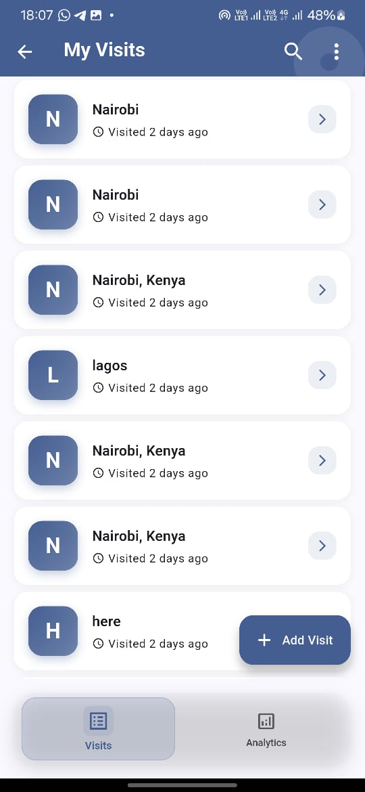
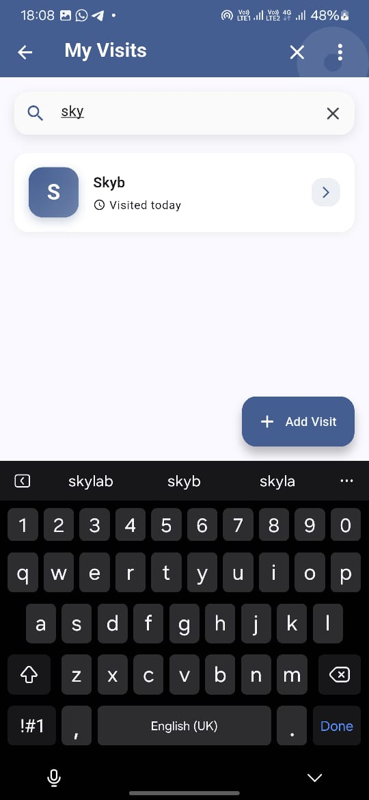
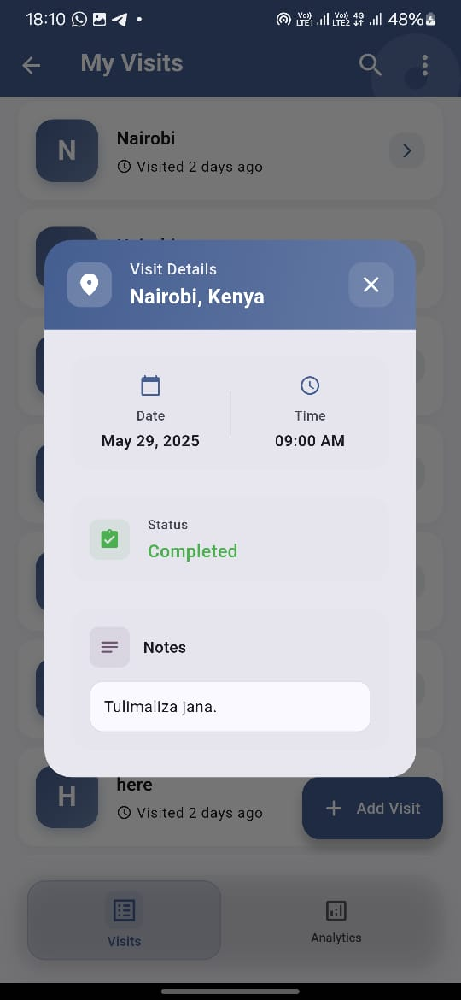
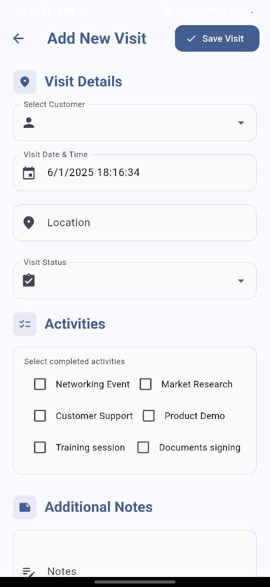
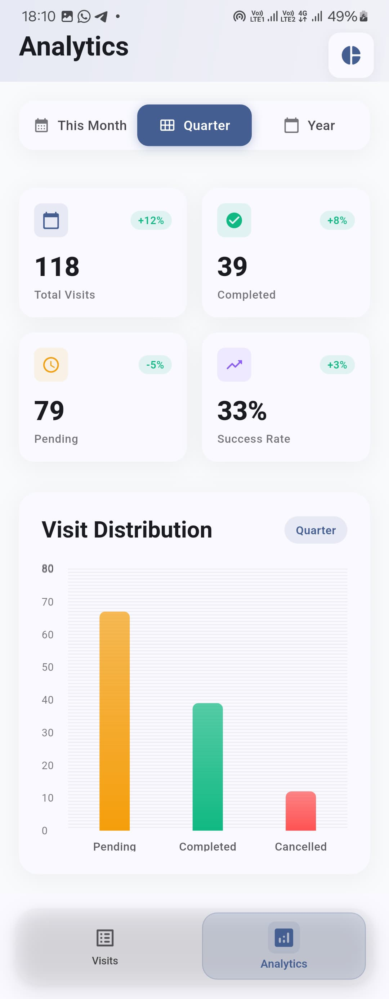
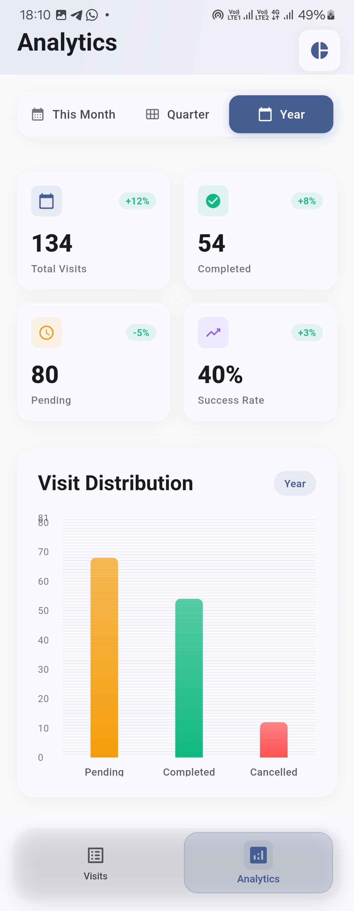
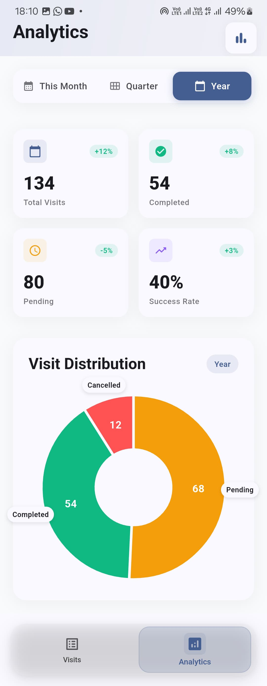

# 🚀 Trackly

A **Route-to-Market (RTM) Sales Force Automation** app that enables sales reps to efficiently track customer visits, manage activities, and visualize visit statistics.

---

## 📱 Screenshots

### Visits Screenshots

<div align="center">
  
  
  
  
</div>

### Statistics Screenshots

<div align="center">
  
  
  
  
</div>
---

## 🎯 Features

- 📍 **Visit Tracking** — Log customer visits with location and timestamp
- 📊 **Activity Management** — Create and track daily sales tasks
- 📈 **Statistics Dashboard** — View visual visit analytics with both pie and bar chart
- 🔄 **Sync Capabilities** — Offline-first with background data synchronization
- 📱 **Responsive Design** — Mobile-first, with smooth UX on all screens

---

## 🏗️ Architecture & Key Design Decisions

### 🧱 Clean Architecture + Repository Pattern

- **Presentation Layer**: UI widgets, pages, view models
- **Domain Layer**: Business logic, entities, use cases, interfaces
- **Data Layer**: Remote/local data sources, API clients, repositories

### 🪴 State Management: `Riverpod`

- ✅ Easy testing & debugging
- ✅ Compile-time safety
- ✅ Scalable for large apps
- ✅ Built-in DI support

### 🧭 Navigation: `GoRouter`

- ✅ Type-safe routes
- ✅ Nested navigation
- ✅ Deep linking
- ✅ Code generation support

---

## 📁 Project Structure

```bash
lib/
├── core/                          # Core utilities and shared components
│   ├── constants/                 # App-wide constants and configuration
│   ├── errors/                    # Custom error classes and handling
│   ├── network/                   # Network utilities and interceptors
│   └── utils/                     # Helper functions and utilities
├── data/                          # Data layer implementation
│   ├── datasources/               # Remote and local data sources
│   ├── models/                    # Data models and DTOs
│   └── repositories/              # Repository implementations
├── domain/                        # Business logic layer
│   ├── entities/                  # Core business entities
│   ├── repositories/              # Repository interfaces
│   └── usecases/                  # Business use cases
├── presentation/                  # UI layer
│   ├── pages/                     # Screen widgets
│   ├── providers/                 # Riverpod providers
│   ├── widgets/                   # Reusable UI components
│   └── router/                    # Navigation configuration
└── main.dart                      # App entry point

```


---

## 🚀 Getting Started

### ✅ Prerequisites

- Flutter SDK (>=3.0.0)
- Dart SDK (>=2.17.0)
- Android Studio / VS Code
- Git

### ⚙️ Installation

```bash
# Clone the repository
git clone https://github.com/mikeyolang/trackly.git
cd trackly

# Install dependencies
flutter pub get

# Run code generation (if applicable)
flutter pub run build_runner build

# Launch the app
flutter run
```

## 📦 Dependencies

```yaml
dependencies:
  flutter_form_builder: ^10.0.1
  flutter_riverpod: ^2.6.1
  form_builder_validators: ^11.1.2
  go_router: ^15.1.2
  hive: ^2.2.3
  hive_flutter: ^1.1.0
  intl: 0.19.0
  json_annotation: ^4.9.0
  riverpod_annotation: ^2.6.1
  freezed_annotation: ^2.4.1
  connectivity_plus: ^6.1.4
 

```

## 🧪 Testing

```bash
# Run all unit and widget tests
flutter test

# Run with coverage
flutter test --coverage

# Integration tests
flutter drive --target=test_driver/app.dart

```

## 📱 Platform Support
- ✅ Android (API 21+)
- ✅ iOS (12.0+)

### Built with ❤️ using Flutter